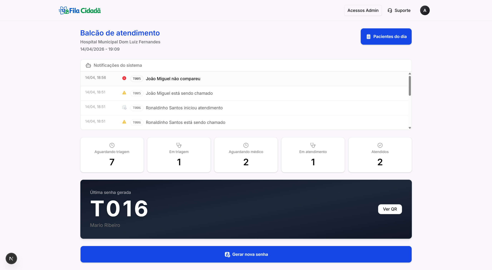
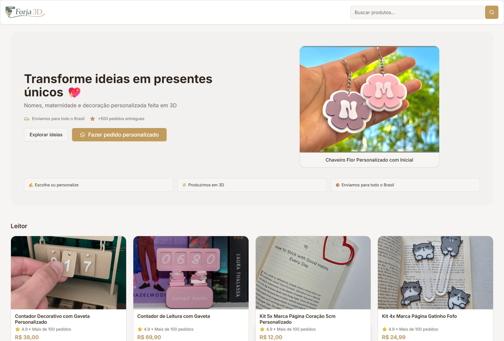
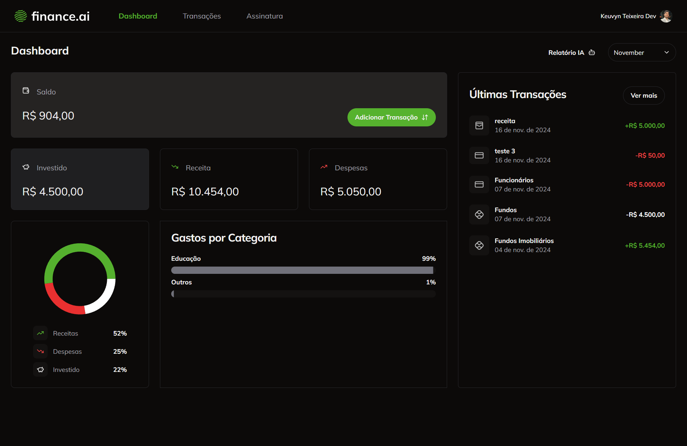
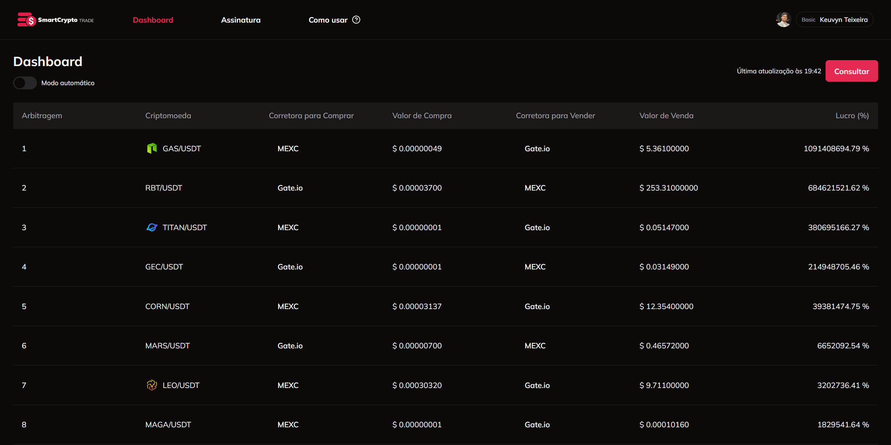
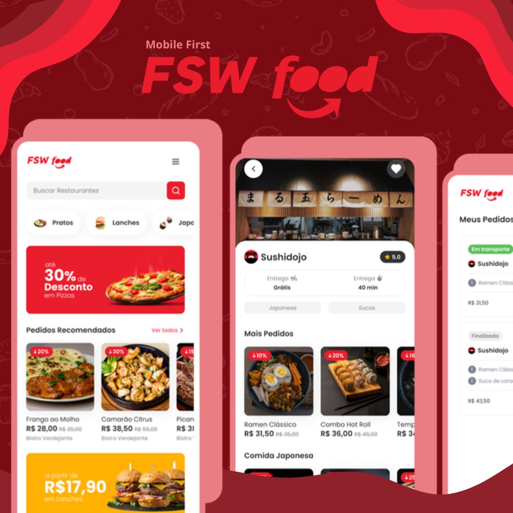
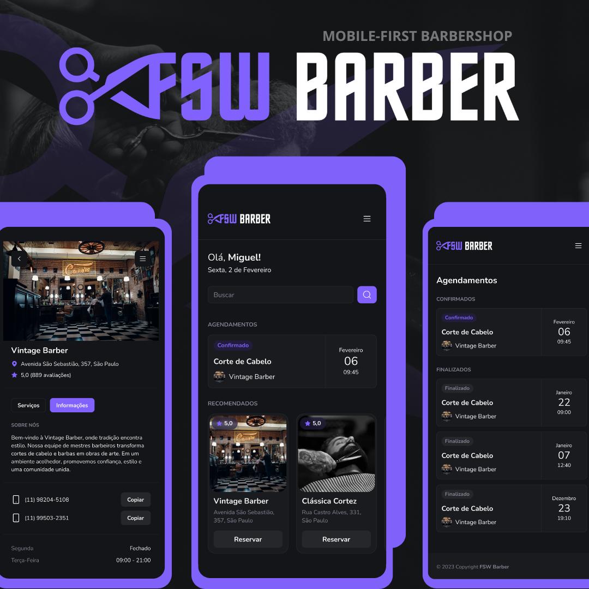
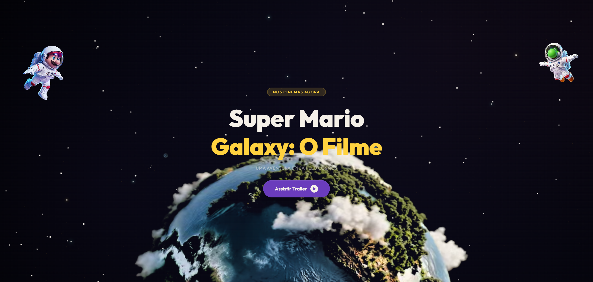

<h1 align="center">Keuvyn Teixeira</h1>

  Full Stack Developer · SaaS & AI-powered products · React · Next.js · TypeScript

  
  
  

---

## About

I'm a Full Stack Developer from Brazil building real-world SaaS platforms, commerce systems and AI-powered web products.

My focus is on **product engineering** — architecting complete digital products with well-defined workflows, solid backend logic, clean UIs and real business value. I care deeply about how systems behave in production, not just how they look in isolation.

Currently working as a **Mid-Level Developer and Team Leader** at Plano Consultoria Empresarial, leading internal automation systems, API integrations and SCRUM workflows for business-oriented solutions.

I'm actively looking for **international remote opportunities** with product-focused companies and modern SaaS teams.

---

## Tech Stack

**Frontend**

**Backend & Database**

**Auth, Payments & AI**

**Infra & Tooling**

---

## Featured Projects

### 🏥 Fila Cidadã — Queue Management Platform

> Real-time queue and attendance management system designed for hospitals and public services.

Built a multi-role workflow engine handling the full ticket lifecycle — from check-in to service completion — with real-time updates via Web Push notifications and QR code tracking.

**Engineering highlights:** complex state machine for ticket transitions · multi-role access control · real-time notification architecture · scalable queue design · mobile-first UX

`Next.js` `TypeScript` `Prisma` `PostgreSQL` `NextAuth` `Web Push` `TailwindCSS`

---

### 🛍 Forja3D — Customizable 3D Commerce Platform

> E-commerce platform for personalized 3D products with dynamic customization and full checkout flow.

Designed the product customization architecture from scratch — supporting variant systems, dynamic rendering, pricing logic and an admin dashboard with full order management.

**Engineering highlights:** dynamic product configuration engine · variant-based pricing system · marketplace-style catalog · admin dashboard · Mercado Pago integration

`Next.js` `TypeScript` `Prisma` `PostgreSQL` `Mercado Pago` `TailwindCSS`

🔗 [Live Demo](https://forja3d.vercel.app/)

---

### 💸 Finance AI — Personal Finance SaaS

> AI-powered financial management platform with subscription plans and intelligent reporting.

Built a complete SaaS product with AI-generated financial insights (OpenAI), Stripe subscription gating, Clerk authentication and an analytics dashboard — covering the full monetization stack.

**Engineering highlights:** AI-generated reports via OpenAI · subscription plan gating · financial analytics dashboard · SaaS onboarding flow

`Next.js` `TypeScript` `Prisma` `PostgreSQL` `Clerk` `Stripe` `OpenAI` `TailwindCSS`

🔗 [Live Demo](https://finance-ai-gamma-ebon.vercel.app/)

---

### 📈 Smart Crypto Trade — Crypto Arbitrage Platform

> Cryptocurrency monitoring and arbitrage dashboard with guided onboarding and premium subscription flow.

Designed the full SaaS UX — from guided onboarding to premium plan upsell — with a real-time arbitrage dashboard and automation mode system.

**Engineering highlights:** arbitrage opportunity dashboard · subscription UX flow · guided onboarding system · premium feature gating

`Next.js` `React` `TypeScript` `Clerk` `TailwindCSS`

🔗 [Live Demo](https://smartcrypto-trade.vercel.app/)

---

### 🍔 FSW Food — Food Delivery Web App

> Mobile-first food delivery platform with restaurant exploration, cart management and checkout flow.

`Next.js` `TypeScript` `PostgreSQL` `TailwindCSS`

🔗 [Live Demo](https://fsw-foods-app-mobile.vercel.app/)

---

### 💈 FSW Barber — Barber Booking Platform

> Mobile-first appointment scheduling platform with Google authentication and calendar system.

`Next.js` `TypeScript` `Prisma` `PostgreSQL` `NextAuth` `TailwindCSS`

🔗 [Live Demo](https://barbershop-app-gamma.vercel.app/)

---

### 🎨 Studio Aura — Premium Interior Design Landing Page

> Luxury landing page with smooth GSAP animations, scroll-driven storytelling and premium UI composition.

`HTML` `CSS` `JavaScript` `GSAP`

🔗 [Live Demo](https://keuvyndev.github.io/lp-aura-design/)

---

### 🎬 Super Mario Galaxy — Cinematic Interactive Landing Page

> Entertainment-style cinematic landing page with animated hero, character showcase and trailer carousel.

`HTML` `CSS` `JavaScript` `GSAP` `ScrollTrigger`

🔗 [Live Demo](https://keuvyndev.github.io/super-mario-galaxy/)

---

## GitHub Stats

  
  

---

## Let's Connect

Open to **international remote opportunities** in Full Stack, SaaS or product engineering roles.

  
  

